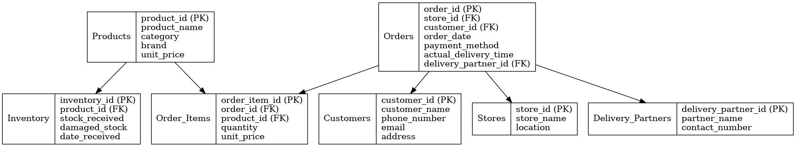

# CIA 2 Project - Blinkit Quick Commerce Database Analysis

## Team Members
- **2311127** Dhaval Bari
- **2311142** Harshit Maheswari  
- **2311143** Hridesh Singhal
- **2311175** Rakshith
- **2311193** Tanish Atreya

## Project Overview
This project implements a comprehensive database analysis system for Blinkit's quick commerce operations. The system is designed using Third Normal Form (3NF) principles and includes data analysis, visualization, and business intelligence capabilities.

## Database Schema
The project implements a normalized database with the following tables:
- **Products**: Product information including pricing, categories, and inventory thresholds
- **Inventory**: Stock management with received and damaged stock tracking
- **Orders**: Customer order details with delivery information
- **Order_Items**: Individual items within each order

### Entity Relationship Diagram


## Features

### 📊 Data Analysis Capabilities
1. **Product Analysis**: Category-wise product listings and brand analysis
2. **Revenue Analytics**: Average pricing, top-selling products, and revenue calculations
3. **Order Management**: Complete order tracking with product details
4. **Store Performance**: Sales analysis across different store locations
5. **Delivery Analytics**: Partner performance and delivery time optimization
6. **Inventory Management**: Damaged stock tracking and percentage analysis

### 📈 Visualizations
- Category-wise revenue distribution
- Top 10 best-selling products by revenue
- Monthly revenue trends
- Payment method usage patterns
- Delivery partner performance metrics
- Store performance rankings
- Damaged stock analysis

## Dataset Files
- `blinkit_inventoryNew.csv` - Inventory data with stock levels
- `blinkit_order_items.csv` - Individual order items
- `blinkit_orders (1).csv` - Order information
- `blinkit_products (1).csv` - Product catalog
- `blinkit.db` - SQLite database file

## Technologies Used
- **Python**: Primary programming language
- **SQLite**: Database management system
- **Pandas**: Data manipulation and analysis
- **Matplotlib & Seaborn**: Data visualization
- **Jupyter Notebook**: Development environment

## Setup and Installation

### Prerequisites
```bash
pip install pandas
pip install sqlite3
pip install matplotlib
pip install seaborn
pip install jupyter
```

### Running the Project
1. Clone or download the project files
2. Ensure all CSV files are in the same directory as the notebook
3. Open `cia2.ipynb` in Jupyter Notebook
4. Run all cells sequentially

## Key Analysis Results

### 🎯 Business Insights
- **JOIN Queries**: 7 comprehensive problem statements solved
- **Revenue Analysis**: Category and product-level revenue tracking
- **Delivery Optimization**: Partner performance metrics for efficiency
- **Inventory Management**: Damage percentage tracking for quality control
- **Store Analytics**: Performance ranking across locations

### 📋 Query Examples
- Product listings with category and brand information
- Average unit prices by category
- Order details with complete product information
- Top performing stores by sales volume
- Delivery time analysis by partner
- Revenue-generating product rankings

## File Structure
```
CIA2-Project/
├── cia2.ipynb              # Main analysis notebook
├── blinkit_inventoryNew.csv
├── blinkit_order_items.csv
├── blinkit_orders (1).csv
├── blinkit_products (1).csv
├── blinkit.db              # Generated SQLite database
├── quick_commerce_erd.png  # Database ERD
└── README.md              # This file
```

## Database Design Features
- **3NF Compliance**: Eliminates data redundancy
- **Foreign Key Relationships**: Maintains data integrity
- **Optimized Queries**: Efficient JOIN operations
- **Scalable Structure**: Supports business growth


**Note**: This project demonstrates database normalization, SQL query optimization, and data visualization techniques for quick commerce business analysis.
